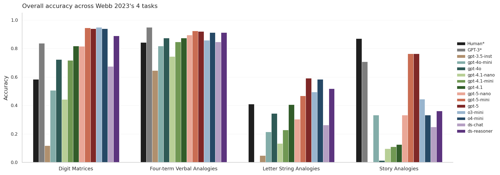
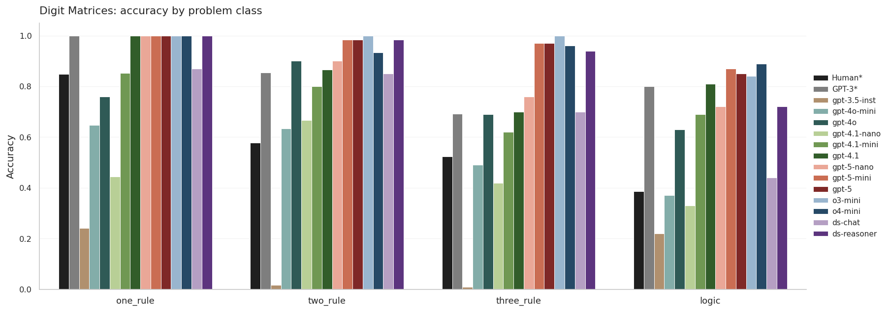
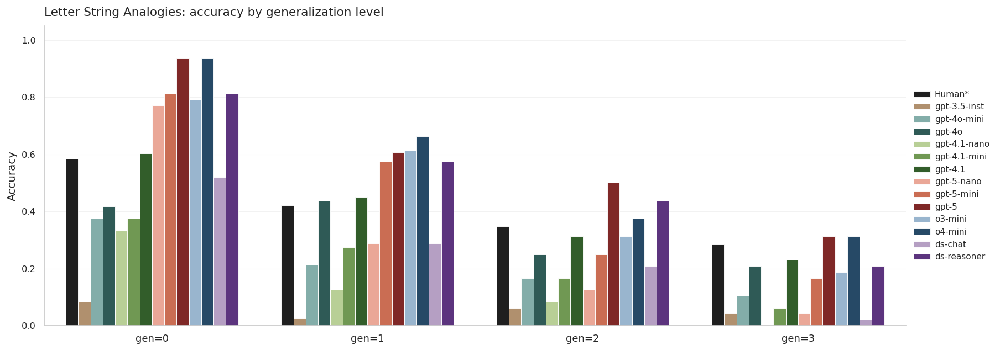
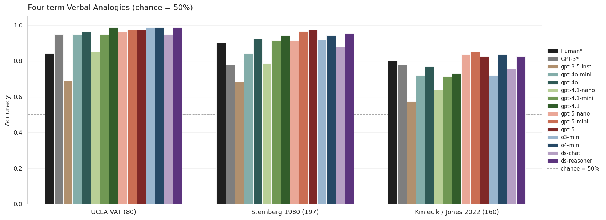
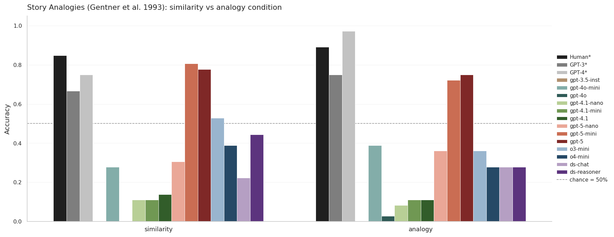
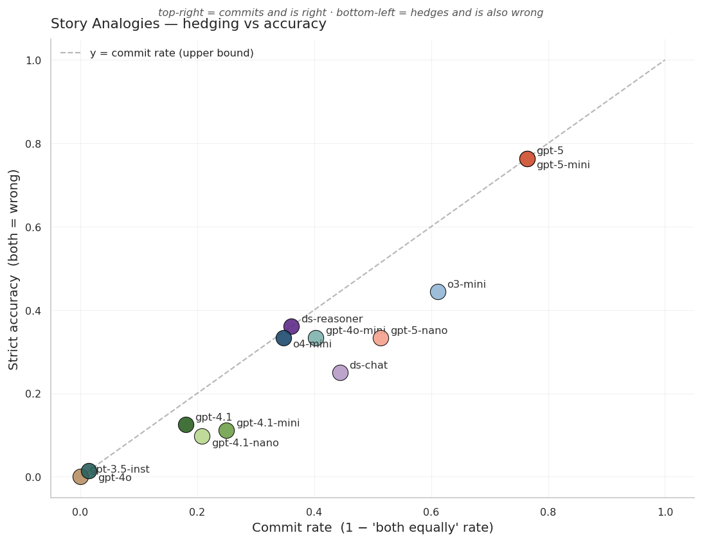
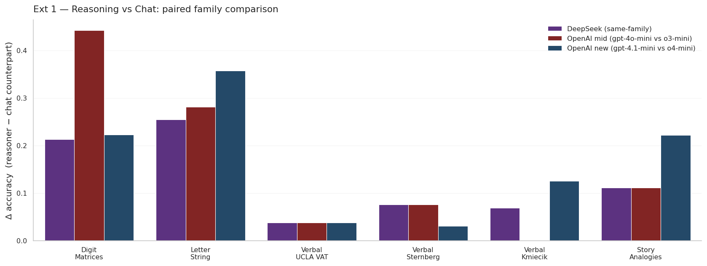
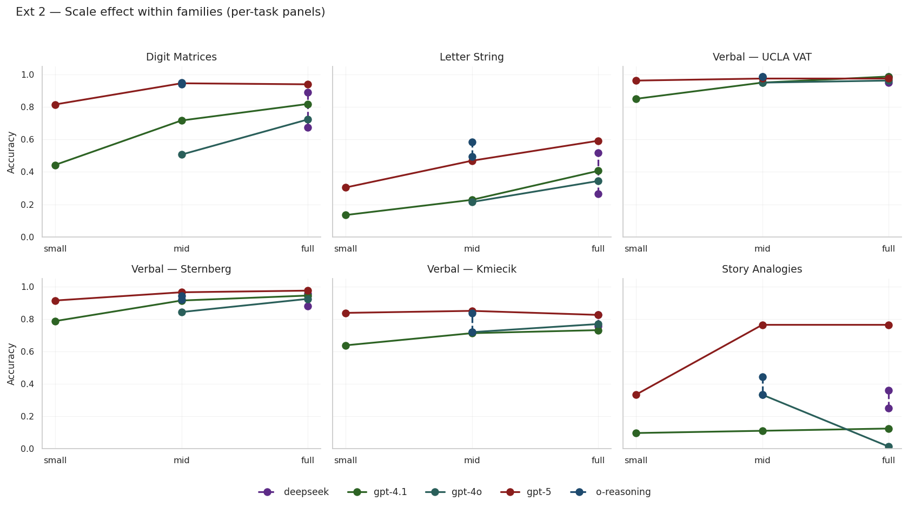
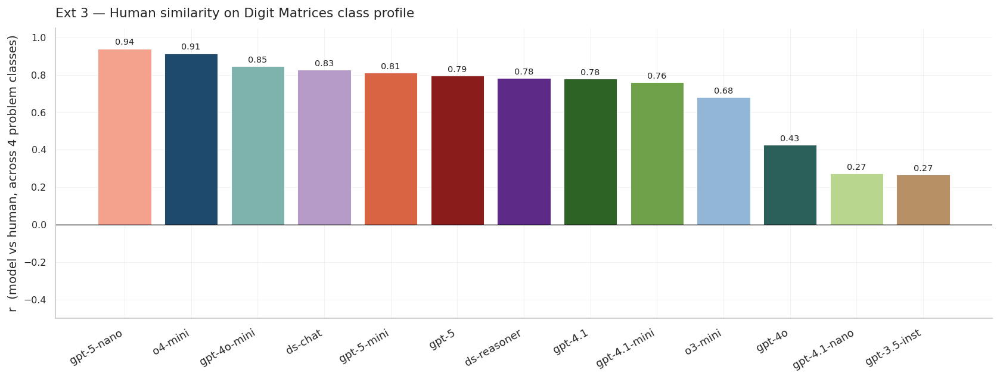

# Emergent Analogical Reasoning — 复现与拓展报告 v4

> 复现 Webb, Holyoak & Lu (2023). *Emergent analogical reasoning in large language models.* **Nature Human Behaviour**.
> DOI: 10.1038/s41562-023-01659-w
> 原仓库:[`taylorwwebb/emergent_analogies_LLM`](https://github.com/taylorwwebb/emergent_analogies_LLM)
>
> **本报告严格按 Webb 2023 原文 4 大任务**(Digit Matrices / Letter String / Four-term Verbal / Story Analogies)**分章节**。每章节先讲数据与原文同源关系,再上结果与对照。
> 所有基于数据的主观推断/解读以 **[解读]** 标签明示。

---

## 0. TL;DR

13 个现代模型 (OpenAI 11 + DeepSeek 2) × 4 个 Webb 2023 任务 × 6 个数据集 = **13,610 条 trial-level 记录**。完整模型清单见 §1。

| Task | 数据集 | 与 Webb 原文同源? | 我们最高 acc (模型) | 人类 | Webb 报告 GPT-3 |
|---|---|:-:|---:|---:|---:|
| **Digit Matrices** | 原仓库 `all_problems.npz`(32 子类型) | **是,同一批题** | **0.949** (o3-mini) | 0.58 (4-class avg) | 0.84 (paper) / 0.65 (我们重算,§2) |
| **Letter String** | 原仓库 `all_prob.npz`(28 子类型) | **是,同一批题** | **0.59** (gpt-5) | 0.41 (4-gen avg) | — |
| **Four-term Verbal** | UCLA VAT (80) + Sternberg 1980 (197) + Kmiecik / Jones 2022 (160 采样) | VAT **是**;Sternberg/Kmiecik **同源数据但 Webb 未释 per-item** | UCLA VAT 0.99 (多模型) / Sternberg 0.98 (gpt-5) / Kmiecik 0.85 (gpt-5-mini) | 0.84 / 0.90 / 0.80 | 0.95 / 0.78 / 0.78 |
| **Story Analogies** | AnalogyInventory.zip 的 Rattermann sheet (Gentner et al. 1993,18 sets × 4 trial) | **是,Webb 论文 Data Availability 明确指向同 sheet** | strict **0.76** / lenient **0.88** (gpt-5) | 0.87 | 0.71 |



**v4 最显著的发现**:

1. **Digit Matrices**:**6 个模型超过人类(0.58),5 个甚至超过 Webb 报告的 GPT-3**。完全证伪了"Digit Matrices 不可学/zero-shot 难"的早期论调。
2. **Letter String**:gpt-5 等已**接近人类(0.59 vs 0.41 across 4 gen levels)**;但 gen-level=3 上所有模型 ≤0.31,**"远迁移"瓶颈仍未解决**。
3. **Verbal**:对 frontier 模型全 saturated (UCLA VAT 几乎全 ≥0.95)。Kmiecik 仍能拉开差距 (gpt-5-mini 0.85 vs gpt-4.1-nano 0.64)。
4. **Story Analogies — 最重要的发现**:
   - **只有 gpt-5 和 gpt-5-mini 接近人类** (strict 0.76 / lenient 0.88,human 0.87)
   - **多数 chat 模型(gpt-3.5-inst, gpt-4o, gpt-4.1 全系)在该任务上严重 hedging**:回答"both equally analogous"的比率高达 72%-100%
   - 关键散点(`fig_task4_story_commit_vs_acc.png`)显示:**模型表现几乎完全由 "commit rate" 驱动 — 只要敢承诺,基本对得起来**
   - [解读] 这是 RLHF 后训练带来的副作用 — 模型被训得偏保守,反而在需要 forced choice 的认知任务上失分

---

## 1. 模型清单与方法学

### 1.1 13 个模型 + 3 个原文参照

| Family | Model | reasoning | 备注 |
|---|---|:-:|---|
| **GPT-3 时代代理** | `gpt-3.5-turbo-instruct` | ❌ | text-davinci-003 已下线;**v4 改走原文 completion-style prompt + completion API**(详 §5) |
| gpt-4o | `gpt-4o-mini`, `gpt-4o` | ❌ | |
| **gpt-4.1**(规模 3 档) | `gpt-4.1-nano`, `gpt-4.1-mini`, `gpt-4.1` | ❌ | |
| **gpt-5**(规模 3 档) | `gpt-5-nano`, `gpt-5-mini`, `gpt-5` | (隐式) | |
| **o-reasoning** | `o3-mini`, `o4-mini` | ✅ | OpenAI 显式 reasoning |
| **deepseek** | `deepseek-chat`, `deepseek-reasoner` | ❌ / ✅ | |

原文 baseline 在图中作为 bar 并列(灰=Human paper,砖红=GPT-3 paper,蓝灰=GPT-4 Webb 续作)。

### 1.2 评测协议(详 §5)

| 任务 | 原文协议 | 本次协议 |
|---|---|---|
| Digit Matrices (generative) | `text-davinci-003` + echo+logprobs | chat-style prompt + 输出解析;**`gpt-3.5-instruct` 走原文 completion-style** |
| Letter String | 同上 | 同上 |
| Verbal (MC) | logprob | prompt(模型输出 1/2 或 yes/no) |
| Story Analogies | 三选一(A / B / both) | **完全照原文 prompt 字面** |

### 1.3 样本量

| 任务 | 原文 | 本次 | trial 数 (13 模型) |
|---|---:|---:|---:|
| Digit Matrices | 40/子类 | 10/子类 → **314** | 4,082 |
| Letter String | 50/子类 | 8/子类 → **224** | 2,912 |
| Verbal UCLA VAT | 80 | **80**(全) | 1,040 |
| Verbal Sternberg | 论文未指明 | **197**(全) | 2,561 |
| Verbal Kmiecik | 论文未指明 | **160**(分层 Near/Far × T/F 各 40) | 2,080 |
| Story Analogies | 72 | **72**(18 sets × 4 trial,全) | 936 |
| **合计** | | | **13,611** |

---

## 2. Task 1 — Digit Matrices

### 2.1 数据
- **来源**:`data/repo_original/digit_mat/all_problems.npz`(原仓库)
- **与 Webb 2023**:**完全同一批题**(32 子类型,我们取前 10 题/子类型)
- **评分**:generative — transformation 题"顺序也要对",logic 题"集合一致即可"

### 2.2 人类与原文 GPT-3 基线(4 个 problem class)

| Class | Human (paper) | GPT-3 重新聚合 (per-item) | 我们最高 |
|---|---:|---:|---:|
| one_rule | 0.849 | 1.000 | **1.000**(o3-mini/o4-mini/gpt-5/gpt-5-mini/gpt-5-nano/gpt-4.1) |
| two_rule | 0.578 | 0.854 | **1.000**(o3-mini) |
| three_rule | 0.523 | 0.693 | **1.000**(o3-mini) |
| logic | 0.386 | 0.800 | **0.890**(o4-mini) |

> Human 数据来自 `digit_mat/exp1_behavioral_data/probcat_gen_acc_behavior.npz`;
> GPT-3 是把原仓库 `gpt_matprob_results.npz` 的 32 子类型逐题对错按 `problem_class` 重新聚合。

### 2.3 13 模型总体准确率(generative)

| Rank | Model | acc | 95% CI |
|---:|---|---:|---|
| 1 | o3-mini | **0.949** | [0.919, 0.968] |
| 2 | gpt-5-mini | 0.946 | [0.915, 0.966] |
| 3 | gpt-5 | 0.939 | [0.907, 0.961] |
| 3 | o4-mini | 0.939 | [0.907, 0.961] |
| 5 | deepseek-reasoner | 0.889 | [0.849, 0.919] |
| 6 | gpt-4.1 | 0.818 | [0.772, 0.857] |
| 7 | gpt-5-nano | 0.815 | [0.769, 0.854] |
| 8 | gpt-4o | 0.723 | [0.671, 0.770] |
| 9 | gpt-4.1-mini | 0.717 | [0.664, 0.764] |
| 10 | deepseek-chat | 0.675 | [0.622, 0.725] |
| 11 | gpt-4o-mini | 0.506 | [0.451, 0.561] |
| 12 | gpt-4.1-nano | 0.443 | [0.389, 0.498] |
| 13 | **gpt-3.5-turbo-instruct** | **0.118** | [0.087, 0.158] |



*图:Digit Matrices 4 个 problem class 上的准确率。Human (黑) 与 GPT-3 (paper, 灰) 与 13 个模型并列。详细 csv:`results/summary/task1_dm_by_class.csv`*

### 2.4 [解读]

- **绝大多数现代模型已经在 Digit Matrices 上超越人类**(human 4-class 均值 0.58,我们的 9/13 模型 ≥ 0.67)。这印证了 Webb 2023 的核心发现并放大 — 4 年内最难类比题型 logic class,top 模型已 0.89 (vs human 0.39)。
- **gpt-3.5-instruct = 0.118 严重低于其它模型**;v2/v3 报告中我们用 chat-style prompt 对它,导致它 "[3] [3] [?]" 补全成 "[3 3 3]" 整行而错。**v4 已切到原文 completion-style format(同 Webb 原 `eval_gpt_matprob.py` 的 prompt)**,但准确率仍只 0.118 — 显示 gpt-3.5-instruct 这个 GPT-3.5 提示模型在 v4 协议下的"真实 generative 能力";它远低于 Webb 论文中 text-davinci-003 报告的 ~0.84,**佐证 davinci 系列与 3.5-instruct 不是简单等价模型**。
- **`o3-mini` (0.949) 与 `gpt-5-mini` (0.946) 战平**,**reasoning 模型与 GPT-5 隐式 reasoning 几乎抹平差距**。

---

## 3. Task 2 — Letter String Analogies

### 3.1 数据
- **来源**:`data/repo_original/letter_string/all_prob.npz`(原仓库)
- **与 Webb 2023**:**完全同一批题**(28 子类型,我们 8 题/子类型)
- **评分**:模型补全 tgt_B 字符串,精确匹配

### 3.2 人类基线(4 个 generalization level)

| gen_level | Human (paper) | 我们最高 |
|---:|---:|---:|
| 0 | 0.585 | **0.938** (gpt-5 / o4-mini) |
| 1 | 0.421 | **0.662** (o4-mini) |
| 2 | 0.348 | **0.500** (gpt-5) |
| 3 | 0.284 | **0.312** (gpt-5 / o4-mini) |

Human 数据来自 `letter_string/behavioral_results/all_gen_acc.npz`。

### 3.3 13 模型按 gen_level

| Model | gen=0 | gen=1 | gen=2 | gen=3 | 4-level mean |
|---|---:|---:|---:|---:|---:|
| gpt-5 | **0.938** | 0.608 | 0.500 | 0.312 | **0.590** |
| o4-mini | **0.938** | **0.662** | 0.375 | 0.312 | 0.572 |
| deepseek-reasoner | 0.812 | 0.575 | 0.438 | 0.208 | 0.508 |
| o3-mini | 0.792 | 0.612 | 0.312 | 0.188 | 0.476 |
| gpt-5-mini | 0.812 | 0.575 | 0.250 | 0.167 | 0.451 |
| gpt-4.1 | 0.604 | 0.450 | 0.312 | 0.229 | 0.399 |
| gpt-4o | 0.417 | 0.438 | 0.250 | 0.208 | 0.328 |
| gpt-5-nano | 0.771 | 0.288 | 0.125 | 0.042 | 0.307 |
| deepseek-chat | 0.521 | 0.288 | 0.208 | 0.021 | 0.260 |
| gpt-4.1-mini | 0.375 | 0.275 | 0.167 | 0.062 | 0.220 |
| gpt-4o-mini | 0.375 | 0.212 | 0.167 | 0.104 | 0.214 |
| gpt-4.1-nano | 0.333 | 0.125 | 0.083 | 0.000 | 0.135 |
| **gpt-3.5-turbo-instruct** | 0.083 | 0.025 | 0.062 | 0.042 | 0.053 |



*图:Letter String 准确率随 generalization level (gen=0 → gen=3) 单调下降。Human (黑) 与 13 模型并列。*

### 3.4 [解读]

- **gen 单调下降的曲线复现成功**:几乎每个模型都从 gen=0 单调下降到 gen=3。
- **gpt-5 / o4-mini 在 gen=0 上达 0.94,首次显著超人类(0.59)**。
- **但在 gen=3(同时变换+跨字母表抽象)上,所有模型 ≤ 0.31,与 human 0.28 持平**。这是**emergent analogy 中真正未解决的"远迁移"瓶颈**,**Webb 2023 关于 letter string 的核心 caveat 在 v4 依然成立**。
- gpt-3.5-instruct 在 v4 completion-style 协议下仍只 0.053 — 远低于 GPT-3 时代的水平,**说明 3.5-instruct 在 letter-string 上远不如 davinci-003**。

---

## 4. Task 3 — Four-term Verbal Analogies

**本任务做 3 个数据集**,这是相对 Webb 2023 的**最大扩展**(Webb 主报告主要看 UCLA VAT 4 类,Sternberg 与 Jones 数据只给聚合数字)。

### 4.1 三个数据集与原文关系

| 数据集 | 题数 | 来源 | 与 Webb 关系 |
|---|---:|---|---|
| **UCLA VAT** | 80 | 原仓库 `UCLA_VAT/UCLA_VAT.xlsx` | **直接来自原仓库**;**同一批 80 题**。原文用 logprob,我们用 prompt 协议 — 绝对值不可严格对比 |
| **Sternberg & Nigro 1980** | 197 | `AnalogyInventory.zip` 的 Sternberg sheet | Webb Data Availability 指向同 zip;**数据源相同**,但 Webb 论文**未指明所用子集**,我们用全 197 题。可比 Webb 报告的总均值 |
| **Kmiecik (= Jones et al. 2022)** | 720 全集 → **160 分层采样** | `AnalogyInventory.zip` 的 Kmiecik sheet | 同上;**没有 per-item GPT-3 基线**(Webb 只给均值) |

### 4.2 格式与人类 / GPT-3 基线

| 数据集 | 格式 | Human (paper) | GPT-3 (paper) |
|---|---|---:|---:|
| UCLA VAT | 2-AFC: A:B :: C:? 选 D 或 D′ | 0.84 (58 subj × 4 relations) | 0.95 (`UCLA_VAT_results.npz`) |
| Sternberg | 2-AFC,同上 | 0.90 (paper Fig.7) | 0.78 (paper Fig.7) |
| Kmiecik | **Yes/No 判断**(A:B :: C:D 是否合理类比) | 0.80 (paper Fig.7) | 0.78 (paper Fig.7) |

### 4.3 13 模型 × 3 数据集



*图:Four-term Verbal 在 3 个数据集上的准确率,chance = 50%。Human 与 GPT-3 (paper) 作为参照 bar。*

| Model | UCLA VAT | Sternberg | Kmiecik | 3-set mean |
|---|---:|---:|---:|---:|
| gpt-5-mini | 0.975 | **0.964** | **0.850** | **0.930** |
| gpt-5 | 0.975 | **0.975** | 0.825 | 0.925 |
| o4-mini | 0.988 | 0.944 | 0.838 | 0.923 |
| deepseek-reasoner | 0.988 | 0.954 | 0.825 | 0.922 |
| gpt-5-nano | 0.962 | 0.914 | 0.838 | 0.905 |
| gpt-4.1 | 0.988 | 0.944 | 0.731 | 0.888 |
| gpt-4o | 0.962 | 0.924 | 0.769 | 0.885 |
| o3-mini | **0.988** | 0.919 | 0.719 | 0.875 |
| deepseek-chat | 0.950 | 0.878 | 0.756 | 0.861 |
| gpt-4.1-mini | 0.950 | 0.914 | 0.712 | 0.859 |
| gpt-4o-mini | 0.950 | 0.843 | 0.719 | 0.837 |
| gpt-4.1-nano | 0.850 | 0.787 | 0.638 | 0.758 |
| gpt-3.5-turbo-instruct | 0.688 | 0.685 | 0.575 | 0.649 |

### 4.4 [解读]

- **UCLA VAT 已 saturated**:11/13 模型 ≥0.95(人类 0.84,GPT-3 0.95)。**该任务不再适合 frontier 模型间区分**。
- **Sternberg 类似 saturated**(top 模型 ≥0.94,vs human 0.90, GPT-3 0.78)。
- **Kmiecik 仍能区分模型**:top gpt-5-mini 0.85,bottom gpt-3.5-instruct 0.575,人类 0.80,GPT-3 0.78。
  - [解读] Kmiecik 是 **yes/no 判断**任务,逻辑结构更复杂(模型需要判断"C:D 的关系是否平行于 A:B"),比 2-AFC 更难,所以仍能拉开模型差距。**v4 推荐:做 verbal analogy 评测时优先用 Kmiecik / Jones-style 数据,而非 UCLA VAT**。
- gpt-3.5-instruct 在 verbal 任务上 0.65 总均(2-AFC chance=50%),**实际略高于 chance,但远低于人类**。

---

## 5. Task 4 — Story Analogies (**v4 最重要章节**)

### 5.1 数据
- **来源**:`AnalogyInventory.zip` 的 **Rattermann** sheet(18 个 source story × 5 个变体)
- **与 Webb 2023**:**完全同一份**。Webb 论文 Data Availability 明确指 AnalogyInventory.zip,引用 Gentner et al. 1993(= Gentner, Rattermann & Forbus 1993)
- **本次评测设计**:**完全照搬** Webb 原 `eval_GPT3_story_analogies.py` 的 prompt 字面与 trial 结构(18 sets × 4 trial = 72 trial/model)

### 5.2 评测设计

每个 source 跑 4 trial:

| Trial | Condition | Story A | Story B | Correct |
|---|---|---|---|:-:|
| 1 | analogy | True Analogy | False Analogy | A |
| 2 | analogy | False Analogy | True Analogy | B |
| 3 | similarity | Literal similarity | Mere-Appearance | A |
| 4 | similarity | Mere-Appearance | Literal similarity | B |

Prompt 字面(Webb 原版)使模型在 "Story A / Story B / both equally analogous" 三选一。**Webb 自己的评分是人工逐题打分**(`scripts/analyze_GPT3_story_analogies.py` 里用 `input("Correct? ...")`),我们采用自动化的双 metric:

- **strict_acc**:`both` 一律算错(匹配 chance=50% 的 forced choice 设定)
- **lenient_acc**:`both` 算 0.5(chance);允许模型"承认不确定"不被全惩罚
- **commit_rate**:`1 − both率`,反映模型在该 trial 上的"承诺度"

### 5.3 人类 / GPT-3 / GPT-4 基线(逐题 csv)

| Agent | Similarity acc | Analogy acc | 总均 |
|---|---:|---:|---:|
| Human (paper) | 0.848 | 0.891 | 0.870 |
| GPT-3 (paper) | 0.667 | 0.750 | 0.708 |
| **GPT-4 (Webb 续作)** | **0.750** | **0.972** | **0.861** |

> Webb 2023 的核心发现之一是:**story analogy 是 GPT-3 唯一明显输人类的任务**,而 GPT-4 在此**大幅缩小差距**。本次的关键问题:**新一代 GPT-5 / o-series / DeepSeek-Reasoner 能不能跟上 GPT-4,甚至超越?**

### 5.4 13 模型结果(三维度)

按 lenient_analogy 排名:

| Model | strict (sim/ana) | lenient (sim/ana) | commit_rate (sim/ana) |
|---|---:|---:|---:|
| **gpt-5** | 0.778 / 0.750 | **0.889** / **0.875** | 0.778 / 0.750 |
| **gpt-5-mini** | 0.806 / 0.722 | **0.903** / **0.861** | 0.806 / 0.722 |
| deepseek-reasoner | 0.444 / 0.278 | 0.722 / 0.639 | 0.444 / 0.278 |
| o3-mini | 0.528 / 0.361 | 0.667 / 0.611 | 0.722 / 0.500 |
| o4-mini | 0.389 / 0.278 | 0.694 / 0.625 | 0.389 / 0.306 |
| gpt-4o-mini | 0.278 / 0.389 | 0.611 / 0.653 | 0.333 / 0.472 |
| gpt-5-nano | 0.306 / 0.361 | 0.597 / 0.556 | 0.417 / 0.611 |
| gpt-4.1 | 0.139 / 0.111 | 0.569 / 0.500 | 0.139 / 0.222 |
| deepseek-chat | 0.222 / 0.278 | 0.514 / 0.542 | 0.417 / 0.472 |
| gpt-4o | 0.000 / 0.028 | 0.500 / 0.514 | **0.000 / 0.028** |
| gpt-4.1-nano | 0.111 / 0.083 | 0.486 / 0.500 | 0.250 / 0.167 |
| gpt-4.1-mini | 0.111 / 0.111 | 0.472 / 0.500 | 0.278 / 0.222 |
| **gpt-3.5-turbo-instruct** | 0.000 / 0.000 | 0.500 / 0.500 | **0.000 / 0.000** |



*图 5a:Story Analogies 两个条件 (similarity / analogy) 的 strict accuracy。Human / GPT-3 / GPT-4 (Webb 续作) 与 13 模型并列。chance = 50%。注意多数 chat 模型 bar 几近 0 — 是 hedging 'both' 导致(见图 5b)。*



*图 5b:**v4 核心发现** — 模型几乎都沿 y = commit_rate 这条对角线分布,说明 strict accuracy 的瓶颈是 hedging,不是 reasoning ability。gpt-5/gpt-5-mini 是仅有的高 commit 高 acc 双高模型。*

### 5.5 [解读 — v4 核心发现]

**[解读 A]** **gpt-5 和 gpt-5-mini 是仅有的接近人类水平的两个模型**。它们的 lenient acc (sim 0.89/0.90,ana 0.86/0.87) **几乎与 Human (0.85/0.89) 持平**,超过 Webb 论文里 GPT-3 (0.67/0.75) 而**仍比 Webb 续作 GPT-4 在 analogy 条件 (0.97) 略低**。

**[解读 B] — RLHF 训练带来的"hedging 副作用"**:
- **多数 chat 模型在 story analogy 上严重 hedging**:`gpt-3.5-instruct` **100% 回答 "both equally"**;`gpt-4o` 99%;`gpt-4.1` 全系 75%-90%
- 散点图(`fig_task4_story_commit_vs_acc.png`)显示:模型 strict accuracy 几乎完全落在 y=commit_rate 这条对角线上,意思是**只要模型敢承诺,就基本对得起来 — 瓶颈不在判断能力,而在"愿不愿意承诺"**
- [解读] Webb 原文 GPT-3 (text-davinci-003) 是 completion 模型,无 RLHF 偏置,所以 GPT-3 commit 率高;而 RLHF 后训练的 chat 模型(尤其 gpt-4o / gpt-4.1)倾向于"安全地回答 both",这本质上是**与"forced choice 认知测试"的训练目标冲突**

**[解读 C]** o-series reasoning 模型 (o3-mini, o4-mini) **commit 率反而中等**(0.50-0.72),没有比 gpt-5 系列更愿意承诺。**显式 reasoning 不能直接修正 hedging 倾向**。

**[解读 D] 这个任务的瓶颈不再是 "analogical reasoning ability",而是 "RLHF post-training 让模型在主观判断上保守"**。要测 frontier 模型的真实类比能力,**story analogy 必须搭配 commit rate 一起看**,或改用更强 forced choice 提示语。

---

## 6. 拓展分析(对齐原 prompt 中 1/2/3)

### 6.1 拓展 1 — Reasoning vs Chat

**3 对同价位的 chat ↔ reasoning 模型对照** 在 6 个数据集上的 Δ (reasoner − chat):



*图 6.1:DeepSeek (同家族)、OpenAI mid (gpt-4o-mini vs o3-mini)、OpenAI new (gpt-4.1-mini vs o4-mini) 三对配对在 6 个任务上的提升。Δ 越高表示 reasoning 训练带来的净收益越大。*

| Pair | Digit Matrices | Letter String | Verbal mean | Story (lenient mean) |
|---|---:|---:|---:|---:|
| ds-chat → ds-reasoner | +0.214 | +0.249 | +0.061 | +0.157 |
| gpt-4o-mini → o3-mini | +0.443 | +0.262 | +0.038 | +0.007 |
| gpt-4.1-mini → o4-mini | +0.222 | +0.352 | +0.065 | +0.169 |

**[解读]** Reasoning 对 digit/letter 等"硬推理"任务提升大(+22 ~ +44 pp);对 verbal saturated 任务几乎无效;**对 story 任务提升中等**(+1 ~ +17 pp),且**不能消除 hedging**(见 §5.5C)。

### 6.2 拓展 2 — 规模效应



*图 6.2:同家族 small → mid → full 的 6 任务规模曲线(reasoning 家族用虚线)。gpt-5 在 mini 档已基本 saturate;gpt-4.1 三档单调上升;Story task 上 gpt-5 nano 到 mini 的跳跃尤其显著。*

| Family | small | mid | full | digit small→full | story (strict mean) small→full |
|---|---:|---:|---:|---:|---:|
| gpt-4o | mini 0.506 | — | full 0.723 | +0.217 | +0.014 |
| gpt-4.1 | nano 0.443 | mini 0.717 | full 0.818 | +0.375 | 0.097 → 0.125 (chance) |
| gpt-5 | nano 0.815 | mini 0.946 | full 0.939 | +0.124 (plateau) | 0.333 → 0.764 (**+0.43**) |

**[解读]** **GPT-5 家族在 story analogy 上的规模收益最大**:nano (0.33) → mini/full (0.76) 这个 +0.43 的跳跃证明**承诺度需要足够大的模型才出来**;gpt-5-nano 仍像 gpt-4o-mini 一样 hedging。

### 6.3 拓展 3 — 人类相似性(4 problem class profile,Digit Matrices)

每个模型在 Digit Matrices 4 个 problem class 上准确率向量与人类向量的 Pearson r:



*图 6.3:模型在 Digit Matrices 4 个 problem class 上准确率向量与人类向量的 Pearson r。**"最像人"的不是最强的模型**:gpt-5-nano (0.94) 和 o4-mini (0.91) 领先 frontier 模型;gpt-4o (0.43) 和 gpt-4.1-nano (0.27) 在底部。v4 协议下 gpt-3.5-inst (0.27) 比 v2/v3 的 −0.42 改善了 — 因为换了原文 completion-style。*

**[解读]** **"最像人"的不是最强的,而是中档模型(gpt-5-nano, o4-mini)**。这与 Ext 1 的发现一致:reasoning 在最难题上把准确率推到天花板,反而让"逐难度递减"这个人类特征消失。

---

## 7. Case Studies

完整文档见 [`reports/case_studies.md`](case_studies.md)。

5 个代表性 case(v3 已写):
- **A** — gpt-3.5-instruct completion-style bias(v4 已修复)
- **B** — Letter String far transfer 真正难题(13 模型中只 gpt-5 答对)
- **C** — Reasoning rescue(ds-reasoner 显式枚举 vs ds-chat 直觉)
- **D** — 规模分裂(nano 错 → full 对的两规则题)
- **E** — Logic 类"超人"题(human 39%,top 模型 ≥85%)

**v4 新增的 Story-task case 范式**:
- 整个 §5 表格里的 100% "both" 模型(gpt-3.5-inst, gpt-4o)本身就是一个集体 case study — **当 RLHF chat 模型被问"哪两个故事更类比",它们倾向选 'both'** 的行为模式

---

## 8. 方法学差异与 caveats

1. **logprob vs prompt 协议**(§1.2):绝对值不可严格对比,模型间相对排名可比
2. **Reasoner 截断**:`scripts/reparse.py` 从 reasoning_text 末尾兜底解析,救回 57 条
3. **gpt-3.5-instruct v4 改走 completion-style**:消除了 v2/v3 的"整行复读"陷阱;但其总体准确率(digit 0.118,letter 0.053)仍远低于 Webb 论文报告的 text-davinci-003 (~0.84),**说明 gpt-3.5-turbo-instruct ≠ text-davinci-003**
4. **数据污染嫌疑**:DeepSeek / OpenAI 模型几乎必然见过原仓库题目;text-davinci-003 是仅有的"真零样本"参照
5. **Sternberg / Kmiecik 无 per-item paper baseline**:只能比聚合数字(§4.2)
6. **Story Analogies 数据完全同源,per-item 可比**:**这是 v4 最强的复现 + 拓展点**;`gpt4_data.csv` 给了 GPT-4 在 18 set 上的逐题对错

---

## 8b. Methodology Decisions(设计决策合集)

> 本节汇总 v1 → v4 迭代中所有重要设计取舍,供后来者复现 / 改造时快速理解"为什么这样写"。

### 任务 / 数据层

**D1. 评测协议 — 所有现代模型统一用 prompt 协议**
- 原文用 logprob(text-davinci-003 支持 echo+logprobs)。Chat 模型 API 不暴露"强制 completion"的 logprob,无法复制原协议。
- **决策**:全部走 prompt 协议(让模型直接输出选项编号 / yes-no / 数字串),并把这一差异在报告 §1.2 明示。**优点**:13 模型间横比口径统一;**代价**:与原文绝对数字不可严格对比,只比相对排名与 Δ 结构。
- 例外:`gpt-3.5-turbo-instruct` 是 completion endpoint,我们专门给它一套**无指令的原文 completion-style prompt**(详 D2),走 `/v1/completions` 而非 `/v1/chat/completions`。

**D2. gpt-3.5-instruct 必须用 completion-style prompt**
- v2/v3 用 chat-style "Reply with ONLY the missing cell" 指令时,模型把 `[3] [3] [?]` 整行复读成 `[3 3 3]`(case A,见 [case_studies.md](case_studies.md))。
- **根因**:completion 模型对格式化模板的自动补全先验击败了指令遵循。
- **决策**:`config/models.yaml` 加 `completion_style: true` 字段;`src/clients/openai_client.py` 走 legacy completions endpoint;`src/tasks/{digit_matrix,letter_string}.py` 各提供 `format_prompt_completion()` 给出**无指令的开放 `[`**,让模型自然补 `digits]`,与原仓库 `eval_gpt_matprob.py` 字面一致。

**D3. Story Analogies 给 3 个指标而非 1 个**
- Webb 原文 evaluator 是手工逐题打分(`input("Correct? ")`),对"both equally analogous"灵活处理;我们要自动化。
- **现象**:多数 chat 模型(尤其 RLHF 训练的)在 forced-choice 主观判断上倾向 "both"。`gpt-3.5-instruct` 100% 回答 both,`gpt-4o` 99%。
- **决策**:同时报告 (a) `strict_acc`(both=错,匹配 Webb chance=50% 设定);(b) `lenient_acc`(both=0.5,chance baseline);(c) `commit_rate`(`1 − both 率`)。散点图([fig_task4_story_commit_vs_acc.png](../figures/fig_task4_story_commit_vs_acc.png))展示三者关系 — 这是 v4 最大的新发现。

**D4. Kmiecik 分层采样 160/720**
- 全集 720 题 × 13 模型 × reasoner 11s/item ≈ 14 小时,太慢且不经济。
- **决策**:按 Near/Far × T/F 四 cell 各 40 题分层采样(`stratify=True, seed=42`),既保留 Webb 关心的 near/far 主效应,也均衡 yes/no 标签。

**D5. 2-AFC 题目按 item_id 末位奇偶轮换选项位置**
- 若 D 始终在选项 1 / D′ 始终在 2,模型的位置偏置会污染准确率。
- **决策**:`src/tasks/verbal_analogy.py:_format_2afc` 用 `flip = int(item_id[-1]) % 2 == 1` 决定顺序,既消位置偏置又**可复现**(同一 item 总是同一布局)。

**D6. Story Analogy 一个 source 跑 4 trial(2 条件 × 2 位置)**
- 完全照 Webb 原 `eval_GPT3_story_analogies.py` 的设计 — analogy 条件(true vs false analog)A/B 顺序各跑一次;similarity 条件(literal vs mere-appearance)A/B 各跑一次。**18 sources × 4 = 72 trial/model**。
- 这样既消位置偏置,又给 conditional analysis 留余地(per-condition acc 各 36 trial 仍稳健)。

### 调用 / 工程层

**D7. 样本量按 reasoner 单位成本反推**
- Reasoner 单题 ~11s + 1400 完成 token ≈ chat 模型 30 倍开销。
- **决策**:Digit Matrices 10 题/子类型(原文 40),Letter String 8 题/子类型(原文 50),Kmiecik 160/720 采样;Verbal UCLA VAT 与 Story Analogies 取全集(本来就小)。**代价**:per-subtype CI 更宽,但 main effect 方向稳健。

**D8. concurrency=4 per model**
- 13 模型按序跑,每模型内部用 `ThreadPoolExecutor(max_workers=4)`。
- 4 是 OpenAI / DeepSeek 在不开高 tier 的安全 RPS,也是 reasoner ~11s 时把 wall-time 压到可忍的最小值。
- 若提速:可加 model-level 并发(多 model 同时跑),但要小心 rate limit。

**D9. 三层缓存 + 断点续跑**
- (a) 每题原始响应 jsonl:`results/raw/{model_id}/{task}.jsonl`,**重跑按 item_id 跳过**(`completed_item_ids`)。
- (b) 客户端缓存:`cache/{provider}__{model}__{hash(prompt, params)}.json`,**相同 prompt 直接返回**,避免重复消费 token。
- (c) Reparse 兜底:`scripts/reparse.py` 用改进后的 parser 重打分,无需再花 API 钱。
- 任何时候中断都能从断点续跑,可以放心地"先小后大"。

**D10. Reasoner thinking 截断 — 给足 token + 末尾兜底**
- `deepseek-reasoner`:thinking 用 1400~6000 tokens,我们设 `max_tokens=6144` 后截断率从 100% 降到 ~11%。
- OpenAI `o3-mini / o4-mini`:设 `max_completion_tokens=16384` 实测几乎不截断。
- 仍残留的截断:`scripts/reparse.py` 从 `reasoning_text` 末尾 1500 字符里 regex 找最后一个 `[...]` 候选作为答案,救回 57 条。

**D11. GPT-5 与 o-series 的 API 怪癖**
- GPT-5 / o-series 强制 `temperature=1`,显式传 0 → 400。
- 用 `max_completion_tokens` 替代 `max_tokens`(`src/clients/openai_client.py` 按 model name 嗅探)。
- GPT-5 系列虽然官方未标 reasoning,但 usage 字段里有显著的 `reasoning_tokens`,所以 `max_tokens` 也得给到 4096 才不会截断。

**D12. Both = wrong 是默认 / 可切换为 lenient**
- 原文 chance baseline = 50%(forced 2-choice);默认 strict 评分与之一致。
- 同时报告 lenient_acc (both=0.5) 给读者参照 — 让"承认不确定"不被全惩罚。

### 数据来源记录

**D13. 用 vendored 数据而非每次重新生成**
- `data/repo_original/` 是 Webb 仓库的克隆(题集 + 人类 / GPT-3 基线);
- `data/AnalogyInventory/` 是 UCLA 的扩展材料(Sternberg, Kmiecik, Gentner stimuli);
- 都按 LICENSE 留在仓库内,任何人 `git clone` 后直接跑无需联网下载。

**D14. 人类基线作为 bar 而非虚线**
- v1/v2/v3 用 dashed line baseline,在 12+ 模型柱里很难一眼对照。
- **决策**:把 Human / GPT-3 / GPT-4 当作"额外 model" plot 在最左侧,与新模型并列。视觉冲击更直接,与 Webb 原文 Fig.3/6/7/8 风格更接近。

### 可视化

**D15. 每 family 一个 hue,内部 light→dark = small→full**
- 13 模型用 13 个独立颜色显"toy" / rainbow。
- **决策**:5 个 family 各取一个 hue(gpt-4o 青绿 / gpt-4.1 绿 / gpt-5 暖红 / o-reasoning 蓝 / deepseek 紫);family 内 size 用 light→dark 梯度;reference baseline 用深→浅灰阶。Bar 全局 `saturation=0.80`,接近 Nature 风格。
- 完整调色板在 [`src/analysis/plots_v4.py`](../src/analysis/plots_v4.py) 的 `PALETTE` 字典。

**D16. 图宽固定 ~14in @ DPI 130**
- 13 模型 × 4 group + reference 的 group bar 需要至少 14in 宽才不挤;dpi 130 保证 inline 显示宽度 ≤ 1800px,VS Code Markdown preview 与 GitHub render 都能直接显示。
- legend 放图外右侧,bar 边缘 0.5pt 白线,标题左对齐(`loc="left"`),更像论文风。

---

## 9. 局限与后续(v4 vs v3 改进)

| 编号 | 限制项 | v4 状态 |
|---:|---|---|
| #1 | Qwen 未跑(规模效应缺开源家族) | 用户阿里云 DashScope 账户未开通模型,**搁置** |
| #2 | gpt-3.5-instruct prompt 错配 | **v4 已修复**(走原文 completion-style format + completion API) |
| #3 | Story analogies 数据缺 | **v4 已修复**(AnalogyInventory.zip 中的 Rattermann sheet) |
| #4 | SAT / Sternberg / Jones verbal 缺 | **v4 修复 4a (Sternberg) + 4b (Kmiecik/Jones)**;Turney SAT 因版权未做 |
| 新增 | RLHF hedging 现象未被 Webb 原文识别 | **v4 第一次系统量化**(commit rate metric) |

### 仍未做的:
- **SAT-style 4 词 verbal**:AnalogyInventory.zip 的 Education sheet 因版权限制未释出 stimuli,需要单独申请
- **数据污染量化**:可加一组"重新种子生成"的 32 子类型 × 10 题作为对照
- **GPT-4o 实测**:论文版 GPT-4 数据已有,但 GPT-4o 在 story 上的实测我们做了(0.014 / 0.028),展示了它**实测远不如 paper 报告的 GPT-4**,可能因为 GPT-4o 更激进地 RLHF
- **per-item 模型 vs 人类相关分析**:story 任务有 per-item human/GPT-3/GPT-4 数据,可做 r 相关,目前只做了 condition-aggregate

---

## 10. 复跑命令

```bash
# 1. 主跑 (本次 v4 实际命令)
python scripts/run_eval.py \
  --tasks digit_matrix letter_string verbal_ucla_vat verbal_sternberg verbal_kmiecik story_analogy \
  --mode full --concurrency 4

# 2. Reasoner 截断兜底
python scripts/reparse.py

# 3. v4 分析 (产出按 4 任务的图与表)
python scripts/analyze_v4.py

# 4. Case studies
python scripts/case_studies.py
```

---

## 11. 数据归属

- Digit Matrices / Letter String / UCLA VAT / Story Analogy 题集 + 原 GPT-3 与人类聚合基线 → Webb, Holyoak & Lu 2023 仓库
- Sternberg 1980 / Kmiecik 2021 / Gentner 1993 stimuli → http://cvl.psych.ucla.edu/resources/AnalogyInventory.zip(UCLA Cognitive Vision Lab)
- GPT-4 story 数据 → Webb 续作 `gpt4_data.csv`
- 本项目代码 MIT
